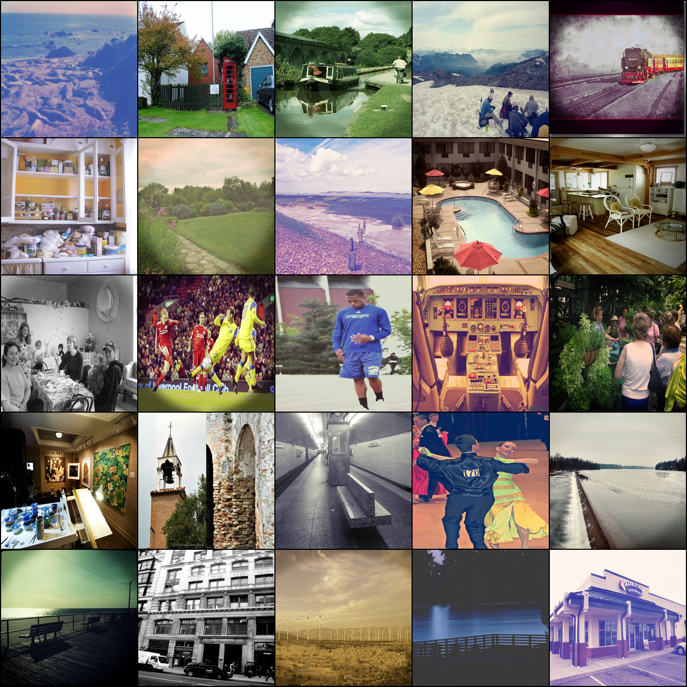
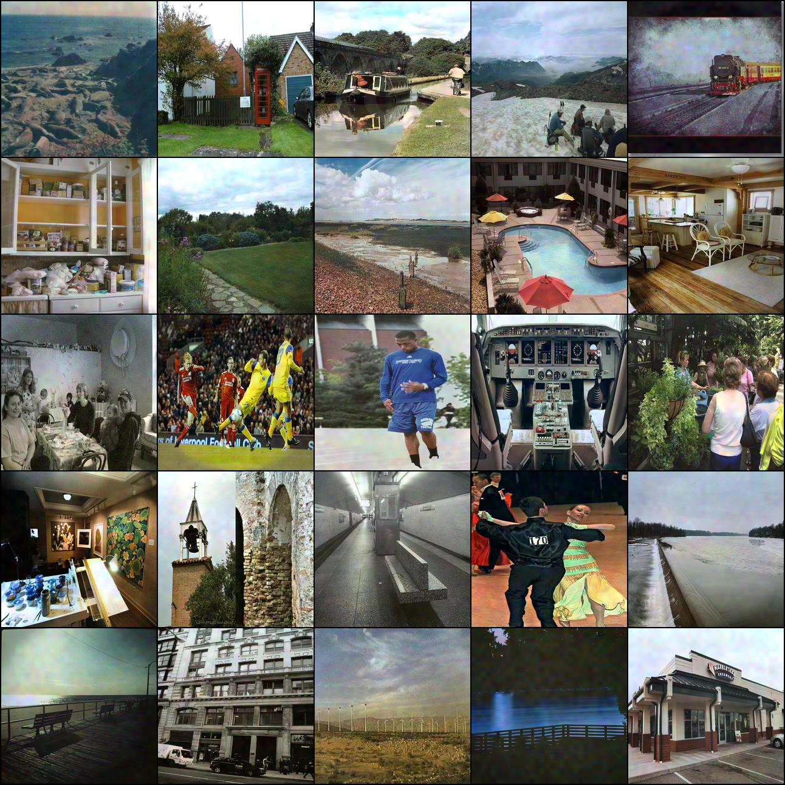

# Computational_Photography
## Artistic Photo Filter Removal Using CNNs

Implementation of the paper "Artistic Photo Filter Removal Using CNNs"
A method has been developed for automatically restoring images that have been modified with
photographic filters, such as those popular on photo sharing services. This method involves using
a convolutional neural network to predict the coefficients of local polynomial transformations,
which are then applied to the input image. Experimentation conducted on a subset of the
Places-205 data set has shown that the quality of the image restoration produced by this method
is significantly better than that of traditional color balancing and restoration techniques, as well
as recent CNN architectures used for image to image translation.

## Input Images

  

## Output Images

  

